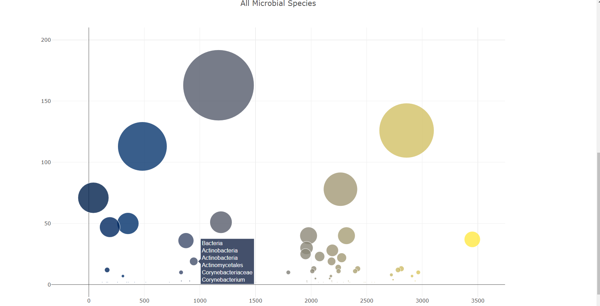

# plotly-homework

## Introduction

This is my submission for the Plotyl Homework.

## Structure
```
|_static
	|_js
		|_app.js
|_.gitignore
|_index.html
|_README.md
|_samples.json
|_dash2.PNG
|_dash1.PNG

```

## Usage
```
#The page was created using:
HTML5
Bootstrap 4.3.1
JavaScript ES6
D3.js
Plotly

```

## Summary


When the Belly Button Biodiversity [Dashboard](https://fernb.github.io/plotly-homework/) is deployed, the default charts will render using the first subjects data.

The subjects can be toggled with the dropdown menu which has been dynamically populated. Selection will filter the imported json data for the sample and metadata realted to the subject ID.

The gauge chart was created using a pie chart as it was easier to calculate the needle postion using a perfect circle whereas the actual gauge chart feature in plotly is slightly eliptical.





